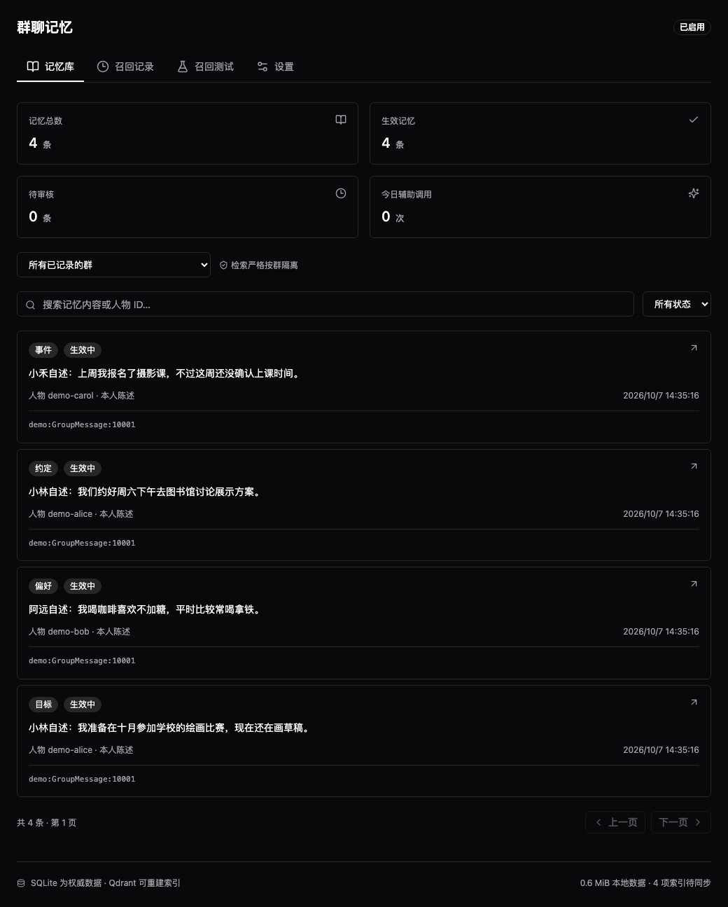
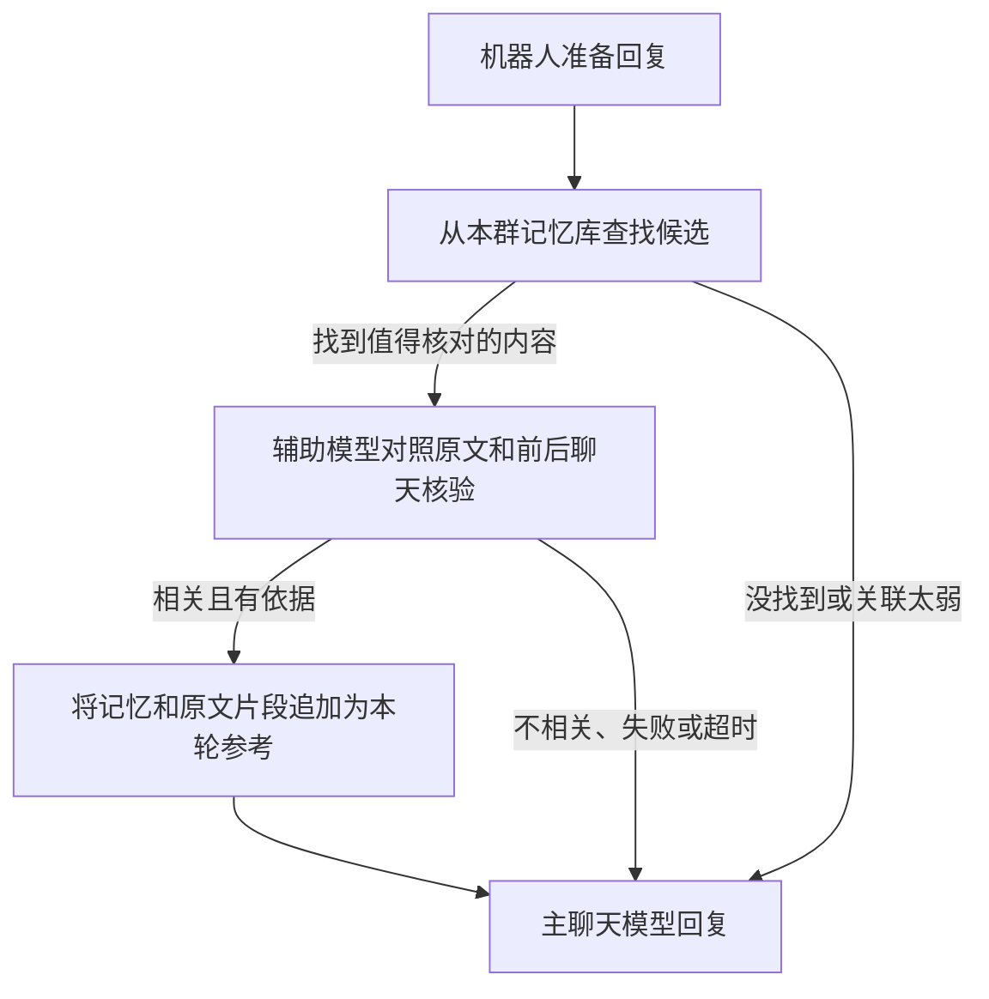
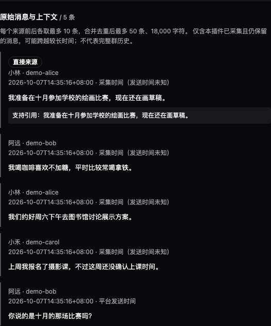

# Eyewitness Memory · 群聊记忆

让 AstrBot 记住群友聊过的事，回答前还能翻回原话核对。

比如，小林在群里说过：

> 我准备在十月参加学校的绘画比赛，现在还在画草稿。

过了一阵，有人问「小林之前说的比赛是什么时候？」，插件会查找相关记忆，连同当时前后的聊天交给辅助模型核对。核对通过后，主聊天模型才会拿到这份参考。

**群友照常聊天就行，不用发记忆命令，也不用让主模型主动调用记忆工具。**

目前支持 **QQ 群聊（aiocqhttp）**，不支持私聊。它不会让机器人主动插话，只在 AstrBot 本来就要回复时查找记忆。



*管理页面实拍。本文截图均使用虚构人物和演示数据，不含真实群聊。*

## 可以拿它做什么

- **记住聊过的事**：偏好、计划、事件和约定，例如「咖啡不加糖」「准备参加比赛」。
- **记不清时翻原话**：每条记忆都带来源，能查看是谁、什么时候说的，以及附近的聊天。
- **各群各记各的**：A 群的聊天不会被拿到 B 群回答；重置普通会话也不会清空记忆库。
- **在网页里管理**：查看、修改、停用、删除记忆，或者测试一句话能找到什么，不用记一堆命令。

## 怎么装

需要 **AstrBot 4.28.1 及以上的 4.x 版本、Python 3.11+**，并且已经接好 QQ 群聊和聊天模型。

### 1. 安装插件

在 AstrBot 的插件管理中，使用这个仓库地址安装：

```text
https://github.com/camera-2018/astrbot_plugin_eyewitness_memory
```

### 2. 填好三个设置

打开插件配置：

| 设置项 | 怎么填 |
| --- | --- |
| 辅助模型 | 从 AstrBot 已配置的聊天模型中选一个。用于整理记忆和核对原文，需要能按要求返回 JSON；可以与主聊天模型不同。 |
| 允许记录的群 | 填完整会话标识，例如 `default:GroupMessage:123456`。`default` 要换成实际的平台标识，`123456` 换成群号，不能只填群号。 |
| 插件开关 | 改为「启用」并保存。 |

群里有其他机器人时，把它们的账号填入「其他机器人 ID」，避免把机器人说的话当成群友记忆。

新安装默认关闭，白名单也为空，**不会自动记录所有群**。建议先开一个熟悉的群，观察提取出来的内容是否合适。

### 3. 打开管理页面

从 AstrBot 的「插件页面」进入「群聊记忆」。它沿用 AstrBot 登录，**不需要另开端口，也没有额外的登录 Token**。在这里修改设置，会同步到 AstrBot 原生插件配置。

插件从启用后开始积累新消息，不会补抓以前的聊天，所以刚装好时记忆库为空是正常的。

<details>
<summary>可选：让“换一种说法”也更容易找到记忆</summary>

只配置辅助模型就能使用，默认按关键词检索。

如果希望「喜欢拿铁」和「平时喝什么咖啡」这样的不同说法更容易关联，可以再配置：

1. AstrBot 中的 **Embedding 模型**：将文本转成用于比较相似度的向量。
2. **Qdrant 地址**：保存这些向量，提供相似内容检索。

两者都配置后才会启用语义检索。Qdrant 不替代本地记忆库，它保存的是可重建的索引；请勿复用其他插件的 Collection。需要鉴权时填写 Qdrant API Key，管理页面不会回显已有密钥，留空保存会保留原值。

「纯语义候选最低分」默认是 `0.55`。调低会让更多候选交给模型核验，也可能增加调用；它不是“记忆正确的概率”，不同 Embedding 模型的分数也不能直接比较。

</details>

<details>
<summary>可选：用 Jev / Clef 帮忙排序候选</summary>

如果网关支持 **System One 决策接口**，可以打开这一项。不需要另填密钥：在「System One 提供方」选择已配置的 AstrBot 提供方，插件只复用它的地址与密钥，不调用该提供方的聊天模型。

| 设置项 | 示例 |
| --- | --- |
| System One 模型名 | `jev-1.13.0` 或 `clef-flash` |
| 接口路径 | New API Jev 插件：`/typesafe/v1/systemone`；Clef 插件：`/clef/v1/systemone`；直连服务：`/v1/systemone` |
| 排序时间上限 | 默认 3 秒，且不超过本轮剩余预算的四分之一 |

它先看候选是否相关，再用该候选自己的局部聊天做原文初核，把更有希望的候选排在前面。**不会因它说“不相关”就删除候选，也不会因它说“支持”就直接注入**；原有辅助模型仍负责提取记忆和最终逐字核验。超时或报错不重试，保留候选继续核验。面板的召回记录与用量统计会显示这部分调用。

这会增加决策模型调用，并不承诺减少原有辅助模型调用。留空提供方或模型名即可关闭。

</details>

## 记忆是怎么用上的

平时，插件会把白名单群的新消息分批整理成记忆。默认积累 **80 条待处理消息**，或最早一条等待 **15 分钟**后开始处理；纯表情、复读等低信息内容先在本地筛选，不是每收到一句话就调用模型。

等机器人准备回复时，再走下面这条路：



一次最多拿 **3 条候选**做联合核验，最多加入 **2 条记忆**。「教我」「继续」这类短句会先结合当前会话或引用消息找到话题；没有明确话题就跳过，不拿群里其他人的插话来猜。纯反应短句不调用 Embedding 或核验模型。

记忆只追加到本轮用户输入的末尾，不改系统提示词、不回改旧消息，并随会话保存。空间不够时会缩短周边聊天，必要原文也放不下就跳过记忆，让机器人照常回复。

这里的「召回」就是**从已有记忆里找相关内容**；「注入」就是**把核验通过的内容交给主聊天模型参考**。找到候选，不代表一定会用。

## 翻回原话，不只看一句摘要

在「记忆库」点开一条记忆，就能看到来源。直接支持这条记忆的发言会标出 **「直接来源」**，旁边还会展开已经保存的前后对话。



每个来源默认向前、向后各取最多 **10 条**，重叠部分去重。每句话都会标明昵称、用户 ID 和时间；拿不到平台发送时间的旧记录，会明确写成「采集时间（发送时间未知）」。

这里只能展示**插件已经采集且仍保留的消息**，不是完整的 QQ 聊天记录。面板里能看到的片段也不一定会全部交给主模型，实际长度还受上下文预算限制。

## 页面里的几个状态是什么意思

| 状态 | 会不会用于回复 |
| --- | --- |
| 生效中 | 未过期时可以参与检索，但每次使用前仍要核验，不是直接当成事实。 |
| 待审核 | 不会使用。转述等不宜直接采信的内容可能进入这里，人工对照原文确认后可以改为生效。 |
| 已停用 | 不会使用，仍保留在管理页面中。 |

模型明确识别为玩笑、无法确认的陈述，或缺少有效来源的候选，不会保存成可用记忆。不过模型仍可能误判，重要信息请自行核对。

想看插件有没有起作用，可以打开：

- **召回记录**：默认看实际聊天的记录，也可切换手动测试；查看找到了什么、为什么使用或跳过，以及失败原因。
- **召回测试**：输入一句模拟提问，查看拟提供给主模型的内容。可能调用辅助模型，但不会向群里发消息。
- **记忆库首页**：查看实际聊天检查了几轮、注入了几次；手动测试另算，不混入注入率。也能查看最近 24 小时的辅助模型调用次数、失败次数和平均输入 tokens。
- **失败提取**：按批次查看失败原因和时间。确认模型服务恢复后，点「重新提取」手动入队，重复点击不会重复提交；再次失败仍不会自动重试。

## 常见问题

<details>
<summary>为什么群里聊了很多，还是没有记忆？</summary>

先检查插件是否启用、完整群标识是否填对、辅助模型是否可用，再看是否已经达到分批处理条件。它主要整理偏好、计划、事件和约定；纯闲聊、玩梗或没有可核对来源的内容不一定会留下记忆。

如果页面提示提取失败，可以直接看具体原因。空回答、超时或格式错误会记为失败，原文按保留周期保存，插件继续处理后续批次；**失败批次不会自动重试**，避免同一段聊天不断重复扣费。请求中途重启，也不会自动重发可能已扣费的请求。

对于 OpenAI 兼容提供方，提取和核验还会关闭 AstrBot 与 SDK 的叠加重试：429 或连接失败只尝试一次，不轮换 Key 重试，也不修改主聊天和其他插件的重试设置。它不会恢复已耗尽的上游额度，后续新批次仍按原计划处理。

</details>

<details>
<summary>明明有记忆，为什么这次没用？</summary>

有记忆不等于和当前问题有关。候选太弱、已过期、待审核、原文不足、核验失败、超时或本轮上下文空间不足，都可能跳过；具体看「召回记录」。

「打开电视」这类不需要历史信息的明确操作，也会跳过记忆；「按上次的设置打开」仍可能查找。节省调用的本地判断可能漏掉隐含关联，不保证每次都能找全。

</details>

<details>
<summary>要多花多少模型费用？会不会拖慢回复？</summary>

后台整理和回复前核验都可能调用辅助模型，**没有每日调用次数上限**。插件会先做本地筛选，并将候选合并核验，减少不必要的调用；实际费用取决于群聊活跃度、模型价格和设置，Embedding 也可能单独计费。

在线检索与核验默认最多等待 **3 秒**，可在设置中调整；慢模型可能在这个时间内来不及返回。辅助模型出错时会跳过记忆，不要求主模型等它成功。

页面中的 tokens 来自提供方返回的用量。没有返回的会标为「未知」，不会当成 0；统计只覆盖本插件的辅助模型调用，不包含主聊天、Embedding 或 SDK 内部重试，也不能补算旧版本数据。

</details>

<details>
<summary>会把上下文撑满吗？reset 会丢记忆吗？</summary>

插件会估算本轮消息、媒体、工具定义、已有工具结果和输出预留占用，再决定能放下多少记忆。有图片或工具结果不会一律关闭记忆；放不下才缩短或跳过，不会无上限追加。估算时不读取媒体文件或下载 URL，但也不等于上游模型的精确计算，长音频、高分辨率图片、其他插件和上游差异仍可能导致超限。

记忆保存在 AstrBot 主机的独立 SQLite 数据库中，重启或 reset 普通会话不会清空它。已经加入会话的参考会随历史保存；正常的会话压缩和 reset 仍会改变历史，插件不承诺永久保持上游缓存。

如果装过旧名称的版本，请先备份并迁移数据，不要同时安装两份。

</details>

## 隐私与数据保留

请先确认有权记录这些群聊，并让群友知道：

- **保存在哪里**：原文和记忆保存在 AstrBot 主机，SQLite 数据库未加密，请保护好主机和备份。
- **会发给谁**：整理和核验时，相关聊天会发给辅助模型；开启语义检索后，相关文本还会发给 Embedding 服务。
- **留多久**：未被记忆引用的原文默认保留 30 天，被引用的来源会继续保留。这不是完整聊天归档工具。
- **删除到哪里为止**：删除插件中的记忆，不会自动清除已进入 AstrBot 会话历史的内容、模型服务日志或备份。

---

有问题或建议，欢迎提交 [Issue](https://github.com/camera-2018/astrbot_plugin_eyewitness_memory/issues)。请提供脱敏日志，不要上传真实聊天数据库或 API Key。

[MIT 许可证](LICENSE) · [第三方组件声明](THIRD_PARTY_NOTICES.md)
